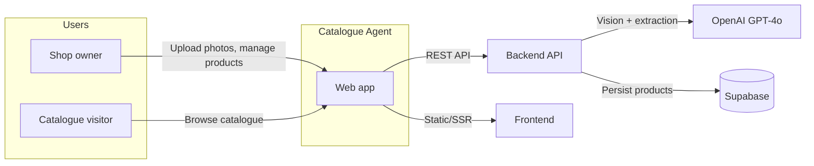
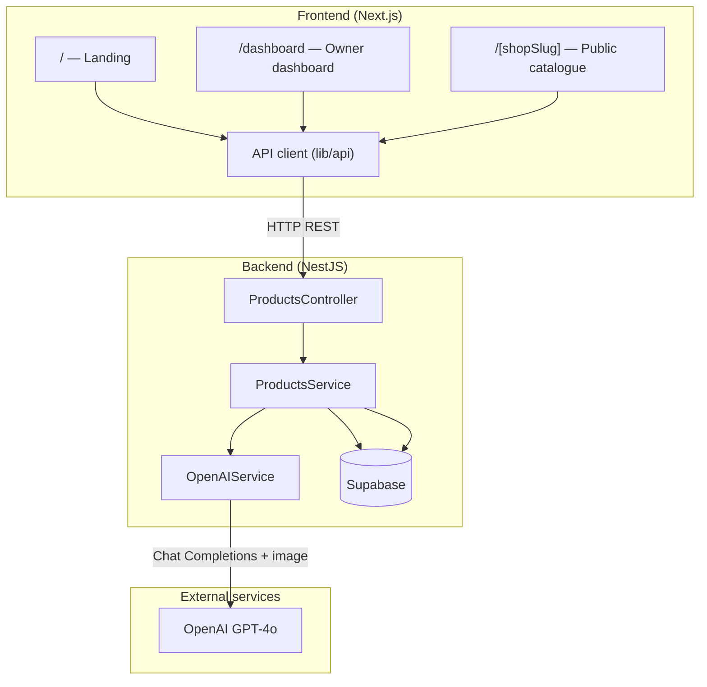
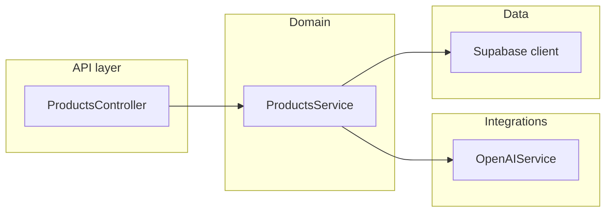
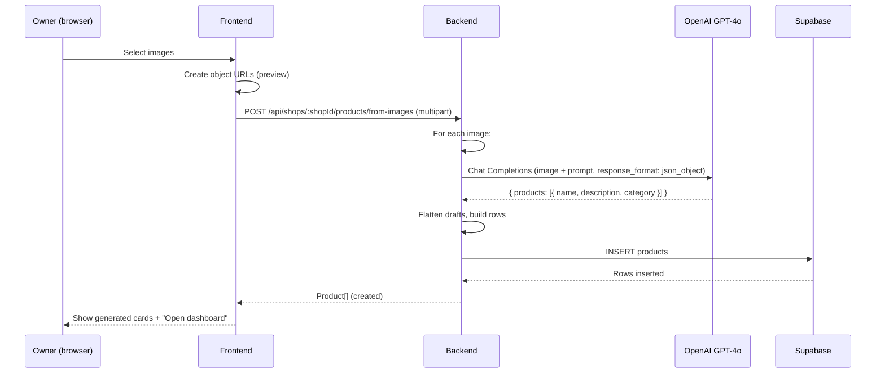
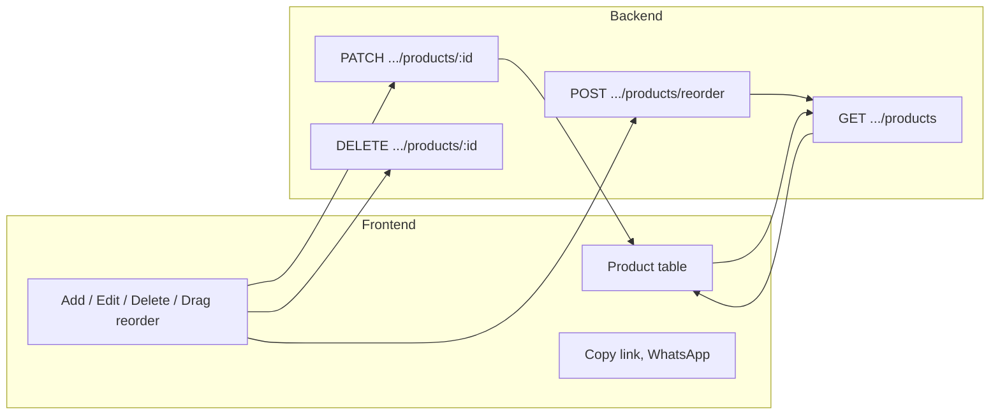
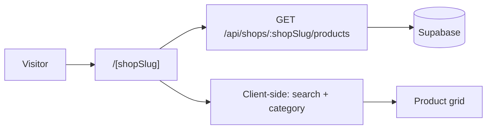

# Catalogue Agent — Architecture

High-level architecture for the AI-powered catalogue generator (monorepo: Next.js frontend, NestJS backend, OpenAI GPT-4o, Supabase).

---

## 1. System context



- **Shop owner**: Uses the app to upload shelf photos, get AI-generated product entries, and manage the catalogue (edit, reorder, share).
- **Catalogue visitor**: Opens the public catalogue (e.g. `/[shopSlug]`), searches and filters, views products.
- **Web app**: Next.js frontend (landing, dashboard, public catalogue) and NestJS backend (API only).
- **External services**: OpenAI (GPT-4o) for image → product extraction; Supabase for product/shop data.

---

## 2. Container diagram



- **Frontend**: Three main surfaces — landing (upload → generate), dashboard (table CRUD, reorder, share link), public catalogue (grid, search, category filters). All backend access via `lib/api`.
- **Backend**: Single module (Products); controller exposes REST; service orchestrates OpenAI and Supabase.
- **External**: OpenAI for image-to-product extraction; Supabase for persistence.

---

## 3. Backend component diagram



| Component | Responsibility |
|-----------|----------------|
| **ProductsController** | REST: `GET/POST /shops/:shopId/products`, `POST from-images`, `PATCH/DELETE :productId`, `POST reorder`. |
| **ProductsService** | List by shop, create drafts from images (orchestrate OpenAI), update, delete, reorder; maps to/from DB. |
| **OpenAIService** | Send image + prompt to GPT-4o; parse JSON `{ products: [{ name, description, category }] }` → `DetectedProductDraft[]`. |
| **Supabase** | Tables: `products` (and shop identity). Admin client via `SUPABASE_URL` + `SUPABASE_SERVICE_ROLE_KEY`. |

---

## 4. Data flow — Generate catalogue from images



- One API call per upload batch; backend calls GPT-4o once per image, then inserts all products in one go.
- Frontend shows skeletons while waiting, then product cards (and optional “Open dashboard” primary action).

---

## 5. Data flow — Dashboard (manage products)



- Dashboard loads products with `GET /shops/:shopId/products`, then uses PATCH/DELETE/POST reorder for edits. Share uses the public catalogue URL and optional WhatsApp link.

---

## 6. Data flow — Public catalogue



- Public page fetches products once by `shopSlug` (same as `shopId` in API). Search and category filters are client-side.

---

## 7. Key configuration

| Layer | Key config |
|-------|------------|
| **Frontend** | `NEXT_PUBLIC_BACKEND_URL` (API base, e.g. `http://localhost:4000`) |
| **Backend** | `OPENAI_API_KEY`, `SUPABASE_URL`, `SUPABASE_SERVICE_ROLE_KEY`, `PORT` (default 4000) |
| **Supabase** | Tables used: `products` (and any shop/tenant fields). Backend uses service role for server-side access. |

---

## 8. File layout (relevant paths)

```
apps/
├── frontend/
│   ├── app/
│   │   ├── page.tsx              # Landing: upload → generate → cards
│   │   ├── dashboard/page.tsx    # Owner: table, CRUD, reorder, share
│   │   ├── [shopSlug]/page.tsx   # Public catalogue
│   │   ├── layout.tsx
│   │   └── lib/api.ts            # Backend API client
│   └── components/ui/            # Button, Skeleton, etc.
│
└── backend/
    └── src/
        ├── main.ts
        ├── app.module.ts
        ├── config/supabase.client.ts
        ├── integrations/openai.service.ts   # GPT-4o extraction
        └── products/
            ├── products.module.ts
            ├── products.controller.ts
            └── products.service.ts
```

This document describes the current architecture; update it when adding new modules (e.g. auth, multi-shop) or changing integrations.
